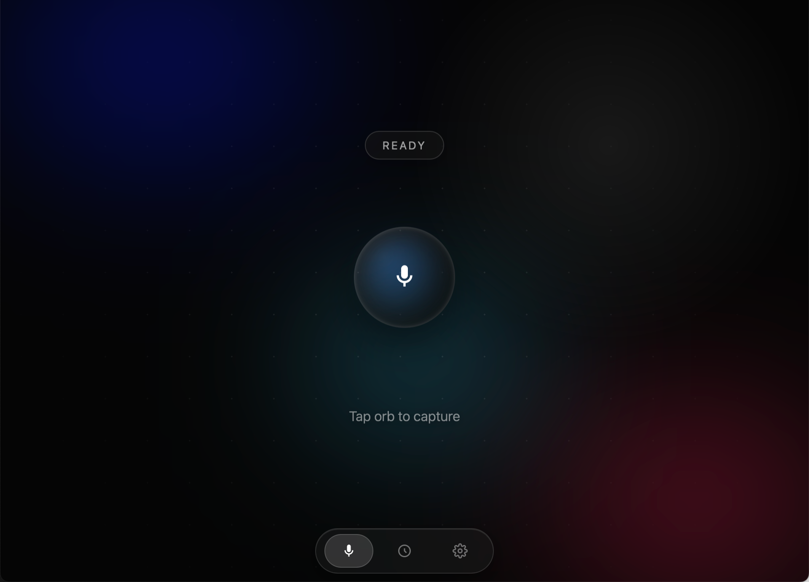
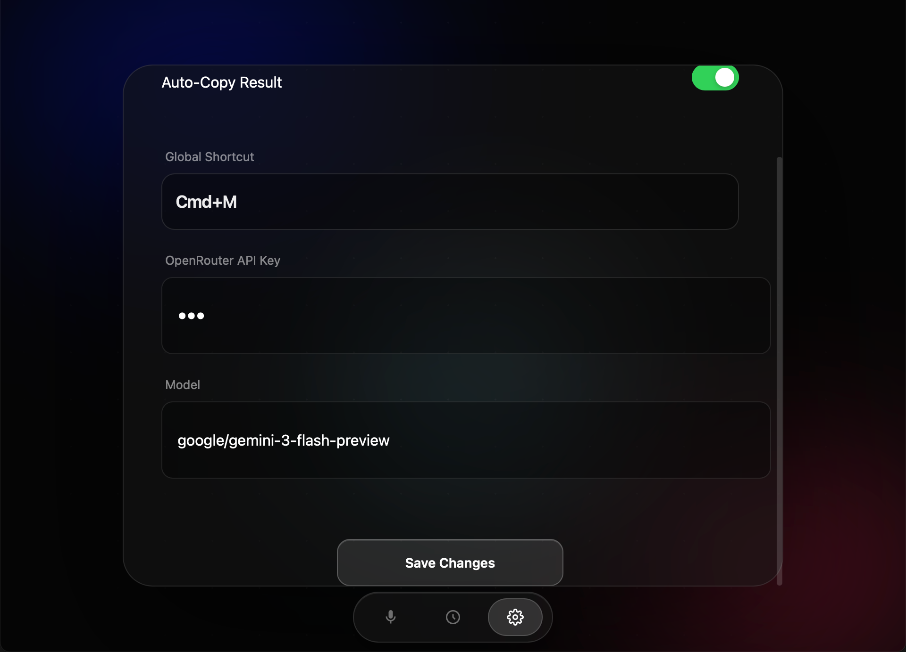

# AItoType 🎙️

<p align="center">
  
</p>

AItoType 是一个开源、免费的桌面端语音转文字工具，基于 **Tauri v2** 构建，旨在提供极致轻量、高效的语音输入体验。

**核心理念**：免费开源、极简设计、高效生产力。

> ⚠️ **声明**：本项目完全开源免费，供大家学习与使用。**严禁用于任何商业盈利行为**。

---

## 📖 TLDR.

- **首次配置**：首次打开需进入配置界面，分两步完成：(1) 选择供应商；(2) 填入 API Key。
- **界面交互**：点击主界面“录制”按钮开始，再次点击停止。识别结果会显示在主界面并可一键复制。
- **后台/快捷键模式**：支持关闭主窗口后台运行。通过预设快捷键唤醒录制，再次按键停止。识别完成后会自动写入当前光标所在输入框（自动粘贴）。
- **历史记录**：History 页面按条目卡片展示，每条可点击直接复制内容。
- **权限引导**：首次使用会引导完成麦克风与辅助功能授权，确保可录音和后台自动写入。
- **供应商**：目前支持 OpenRouter 和 [SiliconFlow](https://cloud.siliconflow.cn/i/zbtzfOmG) 。OpenRouter 默认使用 Gemini 3.0 Flash，[SiliconFlow](https://cloud.siliconflow.cn/i/zbtzfOmG)  默认使用 TeleAI 模型。**划重点，现在硅基流动的TeleAI/TeleSpeechASR完全免费，速度快且随便用。**

## 📸 界面预览

<p align="center">
  
  
</p>

## ✨ 功能特性

- **全局快捷键唤起**：默认 `Alt+Space`（Windows 默认 `Ctrl+Shift+Space`）一键录音，再次按下即可停止并识别。
- **无缝嵌入工作流**：
  - **自动写入（自动粘贴）**：识别完成后，结果自动“打字”到你当前光标所在的输入框（Chatbox、文档、编辑器等）。
  - **自动复制**：可选自动复制结果到剪贴板。
- **历史记录优化**：
  - 历史页面保持大面板展示，每条记录使用独立小卡片显示时间与文本。
  - 点击任意历史卡片可立即复制该条内容，便于二次使用。
- **极致 UI 设计**：
   - "Glass Monolith" 玻璃拟态设计风格。
   - 沉浸式动效与交互反馈。
   - **后台悬浮条**：在后台录音时，屏幕底部显示灵动胶囊状态条，不干扰视线。
- **权限引导更清晰**：
  - 启动后按提示完成系统权限授权（麦克风、辅助功能）。
  - 未授权时会给出可操作提示，减少“录了但不能写入”的问题。
- **灵活的模型支持**：
   - 内置 **OpenRouter** 支持。
   - 默认配置 **Gemini 3.0 Flash**（速度快、精度高、免费额度充裕）。
   - 可自定义 API Key 和 Model（如 GPT-4o, Claude 3.5 Sonnet 等）。
- **隐私安全**：
   - 音频数据仅在您的设备上录制，并直接发送至您配置的 API 服务商。
   - 本地不留存录音音频文件；会保存必要配置（如 API Key、Model、快捷键）以便下次使用。

## 🛠️ 技术栈

- **Core**: [Rust](https://www.rust-lang.org/) (Tauri v2, cpal, hound, arboard, enigo)
- **Frontend**: Vanilla JS + CSS (无框架，追求极致轻量与性能)
- **API**: OpenRouter / SiliconFlow (兼容 OpenAI 格式)

## 🚀 快速开始

### 前置要求

- macOS (目前主要适配平台)
- Node.js 18+
- Rust 环境 (推荐通过 `rustup` 安装)

### 开发运行

```bash
# 1. 克隆项目
git clone https://github.com/your-username/AItoType.git
cd AItoType/src/aitotype

# 2. 安装依赖
npm install

# 3. 启动开发模式
npm run tauri dev
```

### 打包构建

```bash
# 在 src/aitotype 目录下执行
npm run tauri build
```
构建产物通常位于 `src-tauri/target/release/bundle/dmg/*.dmg`。

### 本地脚本命令

在 `/Users/robin/Work/sideproject/AItoType/src/aitotype` 下可用：

1. `npm run dev`：启动开发模式
2. `npm run build`：本机打包当前平台
3. `npm run build:ci`：用于 GitHub Actions 的非交互打包命令

## 📦 下载与安装（给普通用户）

### 下载安装

1. 前往项目 GitHub Releases 页面下载最新 `.dmg`。
2. 双击打开 `.dmg`，将 `AItoType.app` 拖入 `Applications`。
3. 从“应用程序”中启动 AItoType。

### 首次打开被 macOS 拦截时

如果提示“无法验证开发者”或“已损坏”：

1. 在 Finder 里右键应用，选择“打开（Open）”，再确认一次。
2. 或到 `系统设置 -> 隐私与安全性`，点击“仍要打开”。

若仍被 Gatekeeper 拦截（仅限你确认来源可信时）：

```bash
xattr -dr com.apple.quarantine /Applications/AItoType.app
```

## 🧱 打包与发布（给维护者）

### 本地打包

```bash
cd src/aitotype
npm install
npm run tauri build
```

主要产物目录：

- `.app`: `src/aitotype/src-tauri/target/release/bundle/macos/`
- `.dmg`: `src/aitotype/src-tauri/target/release/bundle/dmg/`

## ⚙️ 配置指南

首次启动后，请点击主界面底部的 **设置图标 (⚙️)** 进行配置：

1. **Supplier**: 选择 OpenRouter 或 SiliconFlow。
2. **API Key**: 填入对应平台的 Key（[OpenRouter.ai](https://openrouter.ai/) 或 [SiliconFlow](https://cloud.siliconflow.cn/i/zbtzfOmG) (利益相关：注册会给我 16 元的 token额度有效期 180 天)）。
3. **Model**: OpenRouter 默认 `google/gemini-3-flash-preview`，SiliconFlow 默认使用 TeleAI 模型。你也可以填入其他支持的模型 ID。
4. **Global Shortcut**: 点击录制你习惯的快捷键（如 `Cmd+M` 或 `F1`）。
5. **Auto-Copy**: 开启后，识别结果会自动进入剪贴板。

**注意**：配置会自动保存到本地，重启应用无需重新输入。

## 🔐 权限引导（macOS）

为保证“录音 + 后台自动写入”正常工作，首次使用建议按以下顺序完成授权：

1. **麦克风权限**：允许 AItoType 访问麦克风（系统会弹窗）。
2. **辅助功能权限**：前往 `系统设置 -> 隐私与安全性 -> 辅助功能`，勾选 AItoType。
3. 若权限刚修改，建议重启一次应用再测试快捷键录音与自动写入。

> 说明：未开启辅助功能时，转写依然可能成功，但无法自动写入到其他应用输入框。

## 🔑 API Key 安全说明

- 你的 API Key 会保存在**本机应用配置目录**，不会写入本仓库代码。
- 只要你不手动把该配置文件提交到 GitHub，发布仓库不会泄露你的 Key。
- 当前实现为本地明文保存，建议你：
  - 使用低权限/限额的 API Key；
  - 定期轮换 Key；
  - 后续升级为 Keychain 存储（更安全）。

## 🧭 使用方法

### 首次使用（建议）

1. 打开应用，进入 **Settings** 页面。
2. 选择 **Supplier**，填写对应的 **API Key** 与 **Model**，点击 **Save Changes**。
3. 设置你习惯的全局快捷键（默认 `Alt+Space`，Windows 默认 `Ctrl+Shift+Space`）。
4. 按需开启 `Auto-Copy Result`。

### 日常使用流程

1. 在任意应用中把光标放到目标输入框（如 Chatbox、微信、飞书、编辑器、文档）。
2. 按一次全局快捷键开始录音。
3. 说完后再次按快捷键结束录音，应用会自动转写。
4. 如在后台触发录音，转写完成后会自动把文本粘贴到当前光标位置。
5. 如需手动处理结果，可在主界面中复制文本，或在 History 页面点击某条历史卡片直接复制。

### 常见场景

- **聊天回复**：边说边转写，快速发送长消息。
- **会议纪要**：录制关键语句，集中整理到文档。
- **代码注释/文档**：先口述内容，再微调文字。

## 🤝 贡献与反馈

欢迎提交 Issue 或 Pull Request！无论是功能建议、Bug 反馈还是代码贡献，我们都非常欢迎。

## 📄 许可证 (License)

本项目采用 **CC BY-NC-SA 4.0** 协议（署名-非商业性使用-相同方式共享）。

- ✅ **允许**：复制、分发、修改、二次创作（需署名，并以相同协议共享）。
- ❌ **禁止**：将本项目或其衍生作品用于商业用途。

协议详情：

- License summary: https://creativecommons.org/licenses/by-nc-sa/4.0/
- Legal code: https://creativecommons.org/licenses/by-nc-sa/4.0/legalcode

---

[](https://star-history.com/#robinshi2010/AItoType&Date)

Made with ❤️ by Robin. Enjoy typing with your voice!
